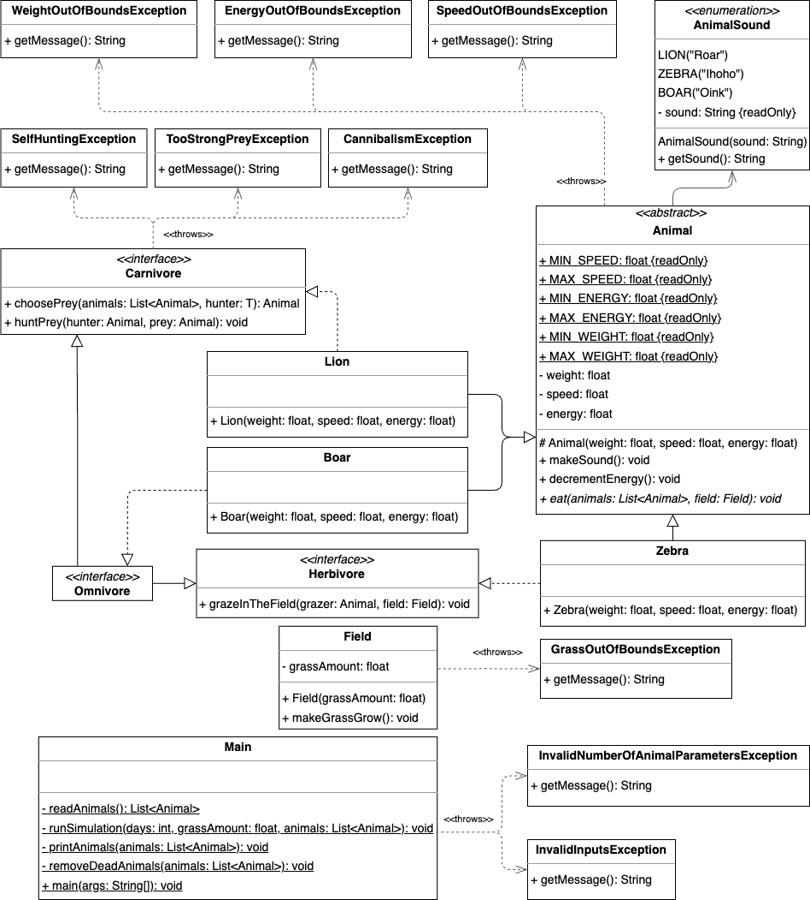

# Forest Simulator

## Problem Description

You are tasked with simulating the behavior of animals in a **forest simlation** over a given number of days. The system manages **herbivores**, **carnivores**, and **omnivores**, each interacting with the environment and other animals based on specific rules.

The simulation involves:
- Animals in a **circular queue**, interacting in a fixed order.
- Managing **grass** as a resource, growing daily but with a maximum limit.
- Animals consuming **grass** or **prey** to gain energy, subject to rules.
- Animals producing sounds unique to their species.

### **Animal Types**
1. **Herbivores**:
   - Can eat grass if available.
2. **Carnivores**:
   - Hunt prey of other types, but not their own.
3. **Omnivores**:
   - Can eat both grass and prey, preferring grass first.

---

## Simulation Rules

### **General Rules**
- Animals lose **1% energy** at the end of each day, regardless of activity.
- Animals with **0% energy** are considered **dead** and removed from the queue.

### **Grass Growth**
- Grass grows **twice its size** daily but is capped at **100 units**.

### **Herbivores and Grass**
- Can eat grass only if the amount exceeds **10% of their weight**.
- Gain energy equal to **10% of their weight**, capped at **100% energy**.

### **Carnivores and Hunting**
- Can hunt prey if:
  - Prey speed < Hunter speed, or
  - Prey energy < Hunter energy.
- Gain energy equal to the prey's weight, capped at **100% energy**.
- Prey energy becomes **0%** (prey dies).

### **Omnivores**
- Prefer eating grass first.
- Can hunt prey after eating grass.

### **Animal Sounds**
- **Lion**: `"Roar"`
- **Zebra**: `"Ihoho"`
- **Boar**: `"Oink"`

---


## Input Format

Input is provided in a file named `input.txt` with the following structure:

1. **Number of Days** (`D`): Integer, `1 ≤ D ≤ 30`.
2. **Grass Amount** (`G`): Integer, `0 ≤ G ≤ 100`.
3. **Number of Animals** (`N`): Integer, `1 ≤ N ≤ 20`.
4. **Animal Properties**:
   - Type (`T`): `Lion`, `Zebra`, or `Boar`.
   - Weight (`W`): Float, `5 ≤ W ≤ 200`.
   - Speed (`S`): Float, `5 ≤ S ≤ 60`.
   - Energy (`E`): Float, `0 ≤ E ≤ 100`.

Example Input:
```text
2
50
3
Lion 100.0 30.0 80
Zebra 90.0 50.0 60
Boar 100.0 30.0 70
